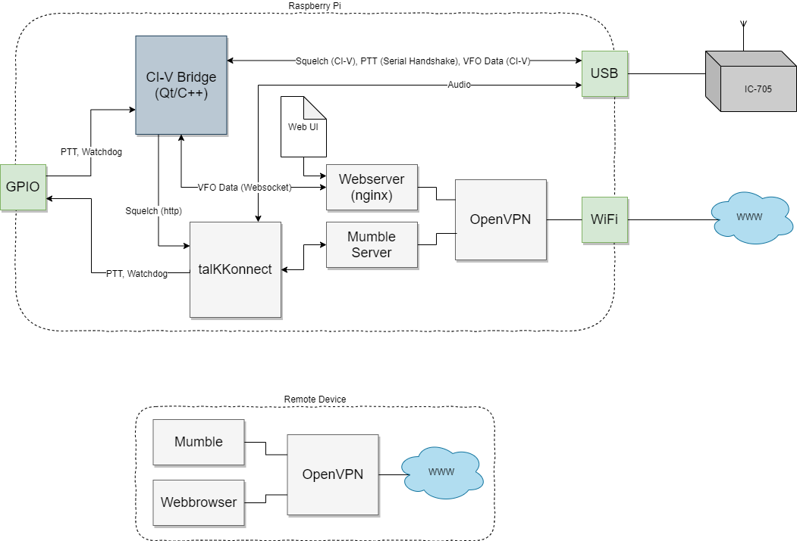
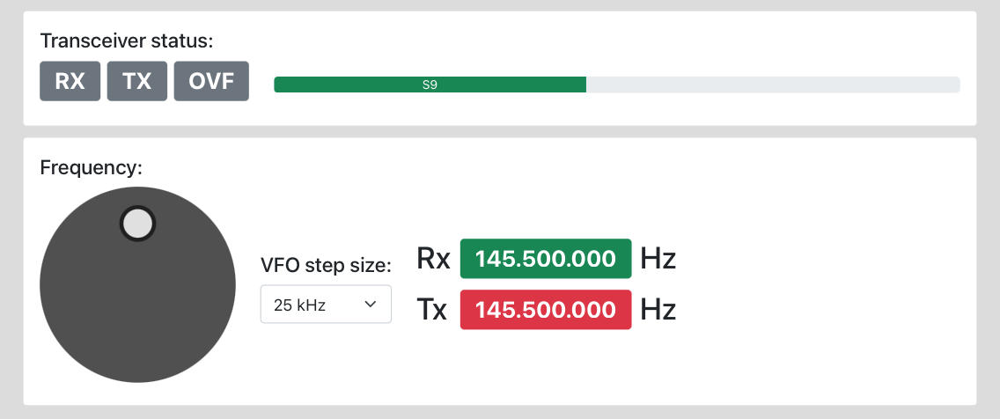

# RemoteTRX
RemoteTRX is a set of software which allows to connect and control an ICOM IC-705 (or similar) radio amateur transceiver via a Raspberry Pi remotely.
* The Raspi acts as a kind of "router".
* [talKKonnect](https://github.com/talkkonnect/talkkonnect) is a Mumble client with some extensions to control it through software/hardware.
* [CI-V Bridge](https://github.com/pe-jot/QtCIV) is a piece of software which handles the data communication between ICOM transceiver, Web UI and talKKonnect.
* The remote device can either be a smartphone/tablet or a PC.
* The control interface is based on web technology, therefore platform independent.
* The connection is secured via a VPN connection, however could be replaced by anything else to your desire.

**Schema:**


**Web UI:**


## Installation
The guide below should give an overview of how to setup the system, however might be incomplete/inaccurate. Also, please be aware that parts might have changed meanwhile due to its natural ongoing development.

#### Prerequisites
Install a current Raspbian system, configure it using `raspi-config`to your desire.

#### WiFi / Network

```shell
vi /etc/dhcpd.conf
interface wlan0
static ip_address=10.0.0.123/24
static routers=10.0.0.1
static domain_name_servers=10.0.0.1 8.8.8.8
```

#### OpenVPN

*Optional, but strongly recommended when connecting to the internet. OpenVPN is offering a point-to-point service, however any other provider may be suitable, too. A service only offering "secure internet connection" or similar is NOT what needed in this case.*

```shell
apt-get install openvpn
```

Get `.ovpn` file from OpenVPN management website.

Copy file to Raspi via WinSCP: 

````shell
cp raspi.ovpn /etc/openvpn/client.conf
````

Then issue a `reboot`.

#### Mumble Server

*Optional if some external Mumble server is being used (e.g. in Hamnet,...).*

```shell
apt-get install mumble-server
dpkg-reconfigure mumble-server
vi /etc/mumble-server.ini
```

Modify parameters `welcometext` and `registerName` to your desire.

#### talKKonnect

*Mumble client with some extra features to handle PTT, etc. operations.*

see: https://github.com/talkkonnect/talkkonnect for build, installation and configuration instructions.

Start talKKonnect for testing (with su): `/home/talkkonnect/bin/talkkonnect`

* Apply custom configuration of `talkkonnect.xml` accordingly.

###### Install talKKonnect as a service:
```shell
cp talkkonnect.service /etc/systemd/system/
chown root:root /etc/systemd/system/talkkonnect.service
chmod 755 /etc/systemd/system/talkkonnect.service
systemctl enable talkkonnect.service
systemctl start talkkonnect.service
```

#### nginx (Webserver)

*Provides the web interface and routes websocket data to CIVBridge.*

```shell
apt-get install nginx
vi /etc/nginx/nginx.conf
```
* Apply custom configuration of `nginx.conf.patch` accordingly (adds reverse proxy for websocket connection).
* Copy web files to `/var/www/html`
* Reload configuration: `nginx -s reload`

#### CIVBridge

*Interconnects between web UI, talkkonnect and transceiver.*

###### Cross compile Qt5 source

* Get toolchain:
```shell
apt-get install git build-essential g++-arm-linux-gnueabihf
```

* Get sources:
```shell
git clone https://code.qt.io/qt/qt5.git
cd qt5
git branch
git checkout 5.15.2
```

* Get Qt submodules (a list of submodules can be found in ```.gitmodules```):
```shell
perl init-repository --module-subset=qtbase,qtserialport,qtwebsockets -f 
```

* Cleanup configuration (e.g. in case of an earlier build):
```shell
make distclean
git submodule foreach --recursive "git clean -dfx" && git clean -dfx
```

* Configure build (a list of options can be found in ```./configure -h```)
```shell
./configure -opensource -nomake examples -nomake tests -confirm-license -device-option CROSS_COMPILE=/usr/bin/arm-linux-gnueabihf- -device linux-rasp-pi-g++ -no-accessibility -no-feature-cssparser -no-feature-evdev -no-feature-freetype -no-feature-gif -no-feature-gui -no-feature-harfbuzz -no-feature-ico -no-feature-linuxfb -no-feature-sql -no-feature-vnc -no-feature-vulkan -no-feature-xml -no-libjpeg -no-libpng -no-sql-sqlite -no-widgets -static -static-runtime
```

* Actual build:
```shell
make -j4
make install
```

###### Cross compile CIVBridge source
On your Linux host machine (e.g. Debian, Ubuntu,...)
```shell
git clone https://github.com/pe-jot/QtCIV.git
cd QtCIV/libCIV
/usr/local/Qt-5.15.2/bin/qmake libCIV.pro
make
cd ../CIVBridge
/usr/local/Qt-5.15.2/bin/qmake CIVBridge.pro
make
```

* Copy CIVBridge binary to `/home/pi/CIVBridge` (or anywhere else suitable)
* Make CIVBridge binary executable (`chmod a+x CIVBridge`)

###### Install CIVBridge as a service:
```shell
cp civbridge.service /etc/systemd/system/
chown root:root /etc/systemd/system/civbridge.service
chmod 755 /etc/systemd/system/civbridge.service
systemctl enable civbridge.service
systemctl start civbridge.service
```

#### IC-705

Configure USB SEND key to `USB (A) RTS`
CI-V Address must be `A4h` (= default)

## Launch
*(with PC / Smartphone)*

* Establish a VPN connection (optional)
* Connect with a Mumble client to your Raspi, either by knowing its IP address or by using *hostname.local*
* Load the webpage, either by knowing Raspi's IP address or by using *hostname.local*